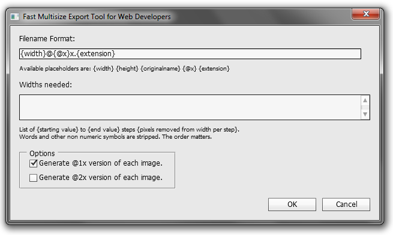

#Photoshop-Fast-Multisize-Export

Automatically exports/saves an image at different sizes. Initially developed to rapidly create different sizes for adaptive images on websites.

The script is currently instable and lacks a lot of features:

- Currently only JPEG-files are supported, options like picture quality must
be changed in the source code. Howevery, another filetype can be easily added.
- The file must be saved. The different sizes are then stored in the same folder.
- It does not verify/validate user input and simply crashes :o)
